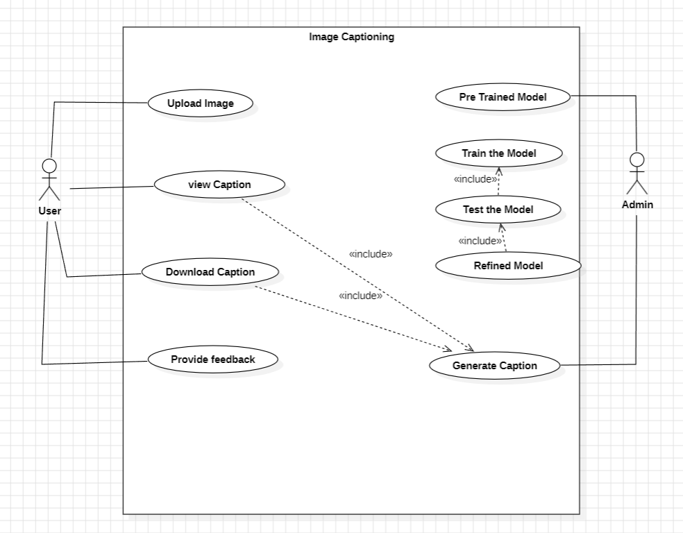

# 🖼️ Image Captioning with Fine-tuned BLIP Model

This project leverages the BLIP (Bootstrapping Language-Image Pre-training) model to generate accurate image captions. By fine-tuning the pre-trained BLIP model with a Kaggle image captioning dataset, we significantly improve the model's captioning accuracy. The refined model is deployed in a user-friendly Streamlit application, allowing users to upload images and receive descriptive captions.

## 📄 Project Description

The **Image Captioning** project aims to enhance the BLIP model's performance through fine-tuning with a specific dataset, leading to better accuracy in generated captions. The Streamlit app serves as an intuitive interface for users to interact with the refined model.

### Key Components

- **Pre-trained Model**: Sourced from Hugging Face.
- **Fine-tuning**: Utilizes a Kaggle image captioning dataset.
- **Streamlit Application**: Facilitates image uploads and displays captions.

## 🖥️ Setup Instructions

### Prerequisites

- Python 3.7 or higher
- Pip (Python package installer)
- Git

### Installation

1. **Clone the repository:**
    ```sh
    git clone https://github.com/yourusername/image-captioning-blip.git
    cd image-captioning-blip
    ```

2. **Install the required packages:**
    ```sh
    pip install -r requirements.txt
    ```

3. **Download the Kaggle dataset:**
    - Visit the [Kaggle dataset page](https://www.kaggle.com/datasets/jpawan33/kag100-image-captioning-dataset).
    - Download the dataset and place it in the `data/` directory.

4. **Fine-tune the model (optional):**
    ```sh
    python fine_tune.py
    ```

### Usage

1. **Run the Streamlit application:**
    ```sh
    streamlit run app.py
    ```

2. **Upload an Image:**
    - Use the file uploader in the Streamlit app to upload an image.

3. **Generate and View Caption:**
    - The app processes the image and displays the generated caption.

## 📊 Diagrams

### Use Case Diagram


### Sequential Diagram


### Data Flow Diagram


### Collaboration Diagram


## 📝 Examples

### Example 1

#### Uploaded Image


#### Generated Caption
*"A cat sitting on a window sill looking outside."*

### Example 2

#### Uploaded Image


#### Generated Caption
*"A group of people hiking up a mountain trail."*

## 🤝 Contributing

Contributions are welcome! Please feel free to submit a Pull Request.

## 📜 License

This project is licensed under the MIT License. See the [LICENSE](LICENSE) file for details.

## 🔗 References

- [BLIP: Bootstrapping Language-Image Pre-training](https://paperswithcode.com/paper/bootstrapping-language-image-pre-training)
- [Kaggle Image Captioning Dataset](https://www.kaggle.com/datasets/jpawan33/kag100-image-captioning-dataset)
- [Streamlit Documentation](https://docs.streamlit.io/)

## 📬 Contact

If you have any questions or suggestions, please feel free to contact us at [theagentvikram@gmail.com].
